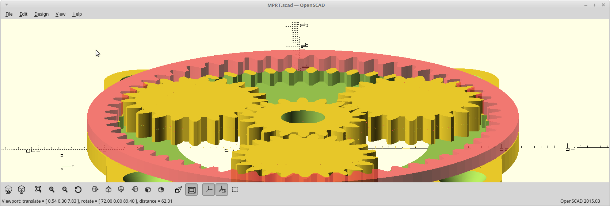

## MPRT - Modified Planetary Robotics Transmission.
The reduction of strain-wave, using a 'single' stage planetary system.

The [MPRT - Modified Planetary Robotics Transmission](https://hackaday.io/project/164732) project is open source hardware. 
This github repository hosts the [OpenSCAD](http://www.openscad.org) source and eventually, the rendered STL images for quick access.

Hardware designs (schematics and CAD) files are licensed under the [Creative Commons Attribution-ShareAlike 3.0 Unported License](http://creativecommons.org/licenses/by-sa/3.0/) and follow the terms of the [OSHW (Open-source hardware) Statement of Principles 1.0.](http://freedomdefined.org/OSHW)
